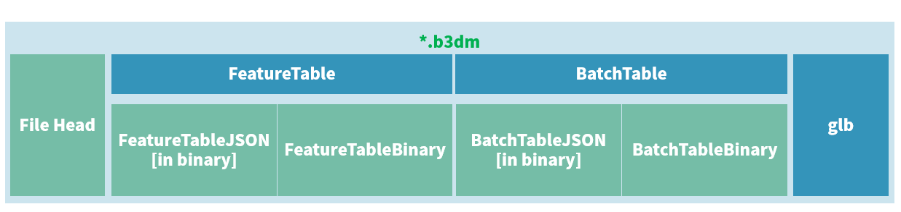

## 从代码库 [3dtiles](https://github.com/fanvanzh/3dtiles) 上Fork代码并修改

从原始地址上fork下来代码后，发现一些不符合要求的地方，于是进行了修改。由于本人对3DTiles格式没什么研究，理解较浅，所以修改不一定对，没敢上传到原始库去，于是就独立了一份代码库。

**重要修改如下：**

1. 升级了GDAL和OSG库的版本，主要是OSG库的版本。低版本OSG库无法读取一些OSGB文件，升级后兼容性更好（[查看](https://github.com/Zoulei-CSU/3dtiles-mod/commit/ed4e8789f05f839607e5768437c68afdb8aef4e9)）；
2. 增加了OSGB文件中旋转矩阵的支持。有些OSGB内部存在旋转矩阵，但是原版转换的时候没读取旋转矩阵，导致转换出来的模型不对（[查看](https://github.com/Zoulei-CSU/3dtiles-mod/commit/6abfe84a9c1e70f181a549aa0f459f8802712c65)）；
3. 重新修改了输出b3dm文件的字节对齐。原版在写要素表和批量表的时候，直接对齐到4字节，没做整体考虑，这个貌似不符合字节对齐要求，于是重新计算了字节对齐（[查看](https://github.com/Zoulei-CSU/3dtiles-mod/commit/1c74e0ab1899bce7e56667746a518ba9c6d45fc1)）；

------

## b3dm文件格式是否正确的检验方法

1. 官方的一个NodeJS的程序：https://github.com/CesiumGS/3d-tiles-validator
2. 使用.NET Core SDK编写的一个检验程序：https://github.com/bertt/b3dm.tooling

------

## 瓦片文件二进制布局（文件结构）

## ① 文件头：占28字节（byte）

位于b3dm文件最开头的28个字节，是7个属性数据：

| 属性的官方名称                 | 字节长 | 类型                | 含义                                  |
| ------------------------------ | ------ | ------------------- | ------------------------------------- |
| `magic`                        | 4      | string（或char[4]） | 该瓦片文件的类型，在b3dm中是 `"b3dm"` |
| `version`                      | 4      | uint32              | 该瓦片的版本，目前限定是 1.           |
| `byteLength`                   | 4      | uint32              | 该瓦片文件的文件大小，单位：byte      |
| `featureTableJSONByteLength`   | 4      | uint32              | 要素表的JSON文本（二进制形式）长度    |
| `featureTableBinaryByteLength` | 4      | uint32              | 要素表的二进制数据长度                |
| `batchTableJSONByteLength`     | 4      | uint32              | 批量表的JSON文本（二进制形式）长度    |
| `batchTableBinaryByteLength`   | 4      | uint32              | 批量表的二进制数据长度                |

其中，

`byteLength` = 28 + `featureTableJSONByteLength` + `featureTableBinaryByteLength` + `batchTableJSONByteLength` + `batchTableBinaryByteLength` + `glb` 的字节长度

## ② 要素表

要素表，记录渲染相关的数据：FeatureTable。

在 b3dm 瓦片中，要素表记录这个批量模型瓦片中模型的个数，这个模型单体在人类逻辑上不可再分。

（在房屋级别来看，房子并不是单体，构造它的门、门把、窗户、屋顶、墙等才是模型单体；但是在模型壳子的普通表面建模数据中，房子就是一个简单的模型）

要素表还可以记录当前瓦片的中心坐标，以便gltf使用相对坐标，压缩顶点坐标数字的数据量。

官方给的定义是：

> 要素表记录的是与渲染有关的数据。

直球！听不懂！

我来“翻译”一下好了：

> 要素表，记录的是整个瓦片渲染相关的数据，而不是渲染所需的数据。
>
> 渲染相关，即有多少个模型，坐标是相对的话相对于哪个中心，如果是点云的话颜色信息是什么以及坐标如何等；
>
> 渲染所需，例如顶点信息、法线贴图材质信息均有glb部分完成。

## ③ 批量表

批量表记录的是每个模型的属性数据，以及扩展数据。

要素表和批量表唯一的联系就是 `BATCH_LENGTH`，在 i3dm 中叫 `INSTANCE_LENGTH`，在 pnts 中叫 `POINTS_LENGTH`。

如果把批量表删除，那么3dTiles数据还能正常渲染。

批量表就是所谓的模型属性表，批量表中每个属性数组的个数，就等于模型的个数，因为有多少个模型就对应多少个属性嘛！

批量表相对比较自由，只要能与模型对得上号，想写啥就写啥。

## ④ 内嵌的glb

本部分略，对glb数据感兴趣的读者可自行查阅 glTF 数据规范。

关于两大数据表如何与glb每一个顶点进行关联的，在前篇也有简略介绍。可以参考官方的说明：

https://github.com/CesiumGS/3d-tiles/tree/master/specification/TileFormats/Batched3DModel#binary-gltf

## ⑤ 字节对齐与编码端序

### JSON二进制文本对齐

FeatureTableJSON、BatchTableJSON的二进制文本，最后一个字节相对于整个b3dm文件来说，偏移量必须是8的倍数。

如果不对齐，必须用二进制空格（即 `0x20`）填够。

因为 FeatureTableJSON 之前是28byte的 文件头，为了凑齐8倍数对齐，末尾对齐，即 (28 + ftJSON长)能整除8，(28 + ftTable长 + btJSON长)能整除8.

### 数据体的起始、末尾对齐

二进制数据体，无论是要素表、批量表，首个字节相对于b3dm文件的字节偏移量，必须是8的倍数，结束字节的字节偏移量，也必须是8的倍数。

如果不满足，可以填充任意数据字节满足此要求。

特别的，二进制数据体中，每一个属性值的第一个数值的第一个字节的偏移量，相对于整个b3dm文件，必须是其 `componentType` 的倍数，如果不满足，则必须用空白字节填满。

例如，上述 height 属性所在的批量表二进制数据体，理所当然位于批量表JSON之后，而批量表的JSON又是8byte对齐的，假设批量表的数据体起始字节是800，那么 height 的第一个值起始字节就是 800，由于 height 属性的 componentType 是 FLOAT，即 4字节，800 ÷ 4 能整除，所以没有问题。

但是，假如 换一个属性，其 componentType 是 `BYTE`，即 1字节，那么假设第二个属性的 componentType 是 DOUBLE，即 8字节，就会出现 第二个属性的第一个值起始偏移量是810，810 ÷ 8 并不能整除，必须补齐 6个空白字节，以满足第二个属性第一个值的起始偏移量是 810+6 = 816字节。

### 编码端序

要素表、批量表的二进制数据，无论是JSON还是数据体，均使用小端序编码（LittleEndian）。

## ⑥ 扩展数据（extensions）与额外补充信息（extras）

其实，无论是要素表，还是批量表，都允许在JSON中存在扩展数据，以扩充当前瓦片模型的功能，而并不是单一的一个一个模型顺次存储在瓦片文件、glb中。

参考：

https://www.cnblogs.com/onsummer/p/13200906.html

https://www.cnblogs.com/onsummer/p/13252896.html

